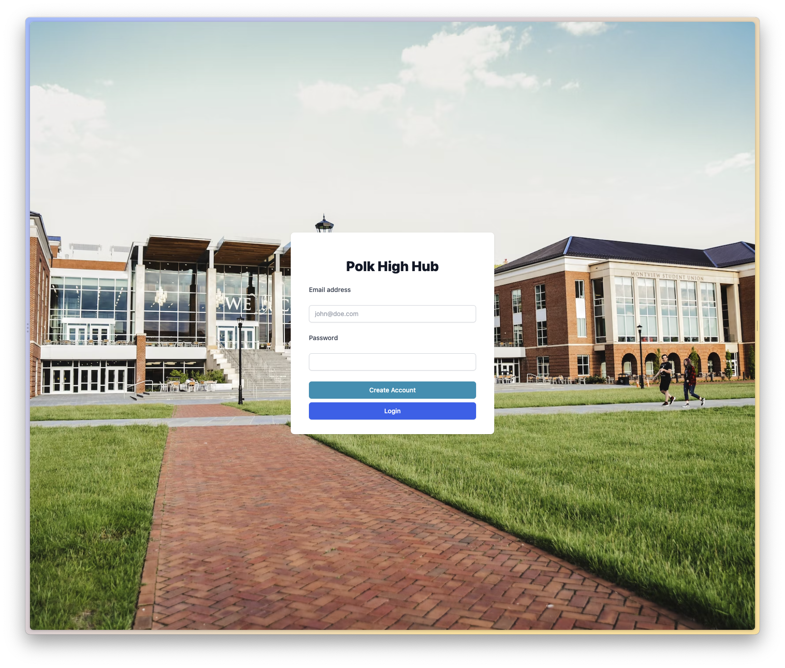
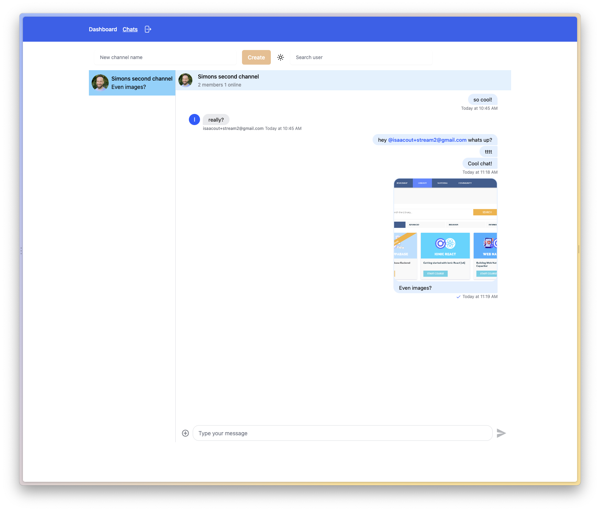

# GetStream Chat App with Angular

This is a chat example using [Stream](https://getstream.io/)!

## Development

Make sure you create your own _.env_ file using the example env and paste in your [Stream](https://getstream.io/) keys!

Run `netlify dev` to bring up the app & functions. Navigate to `http://localhost:8888/` to access the app, because the functions need to run on the same domain to prevent CORS issues.

## Preview

You can find a running version of this app here: [Angular Stream Chat](https://sweet-pie-0c1164.netlify.app/)

Preview of the login:

Preview of the chat:

